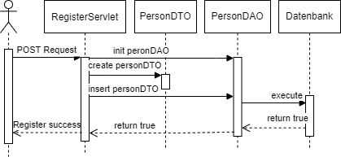
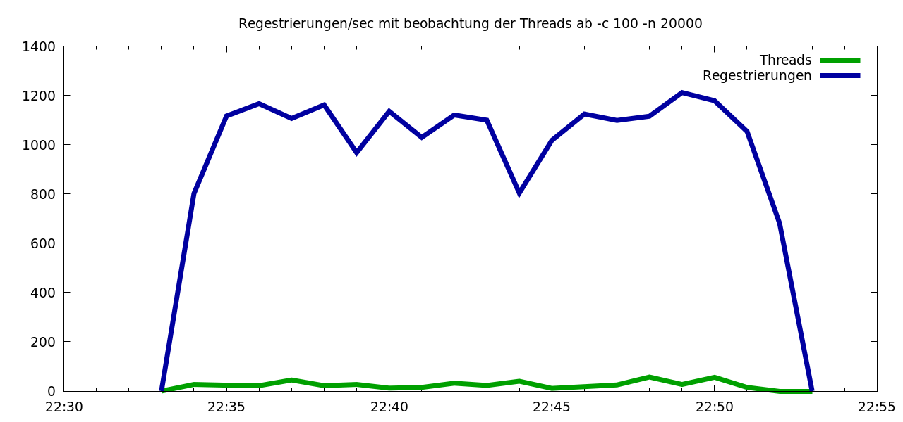

# Tomcat Servlet Starter Kit

Minimalistisches Build- und Deployment-Setup für Java-Servlet-Anwendungen unter Apache Tomcat.

## 📁 Projektstruktur

* `src/` – Java-Quellcode (Paket `hbv`)
* `app/` – Deployment-Struktur (`web.xml`, HTML-Dateien, Laufzeit-Bibliotheken)
* `complibs/` – JAR-Dateien für die Kompilierung (`servlet-api.jar`)
* `build/` – Temporäres Build-Verzeichnis (wird automatisch erzeugt)

## 🛠 Shell-Skripte

* `./mkanddeploy.sh` – Baut das Projekt (`app/` → `build/`, Kompilierung von `src/` nach `build/WEB-INF/classes`) und deployt es via `curl` über die Tomcat Manager-App (Authentifizierung via `.netrc`).
* `./undeploy.sh` – Entfernt die Anwendung vom Tomcat-Server.
* `./list.sh` – Listet alle aktuell aktiven WebApps auf dem Tomcat-Server auf.
* `./clean.sh` – Löscht das `build/`-Verzeichnis und erzeugte WAR-Dateien.

## 📐 Architektur & Ablauf

* **Sequenzdiagramm der Registrierung:** Darstellung des Datenflusses von der POST-Anfrage des Clients über das `RegisterServlet`, das Mapping via `PersonDTO` und den Datenbankzugriff mittels `PersonDAO`.

---

## 📊 Performance & Lasttest

* **Lasttest-Analyse (Apache Benchmark):** Messung von durchgesetzten Registrierungen pro Sekunde unter hoher Koppelung (100 gleichzeitige Verbindungen, 20.000 Anfragen)[cite: 1]. Die Grafik zeigt eine stabile Systemleistung bei durchschnittlich 26 aktiven Threads und Reaktionszeiten von 5–10 ms.
